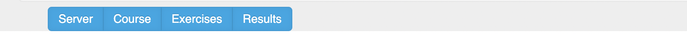
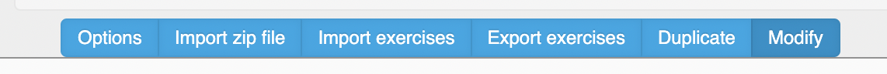

***************
Finishing, archiving and migrating  a course
***************

.. include:: /global.rst

After finishing a course, make sure you archive the course results and exercises as described in 1) so you can access the results on your own computer without an OpenTA instance. Separately archive the exercises as in 2) so you can start your new course with the saved exercises. 

.. important::
       zip files can be subtly different across different operating systems. To be sure you can use your downloaded zip files in a new  OpenTA server,  make sure you have the original zip file available. Do not assume a rezip will will work.  Just to be sure, unzip a copy to inspect the filetree.

1) Archiving your  complete course
========================

* Press Home (|fa-home|) on the toolbar and if necessary (|fa-arrow-circle-up|) to bring up the menu bar:
 
.. image:: fig1.png
     :align: center
     :width: 600px

* Then press ``Server``

* Press ``Export``. This will enable a complete archive of the course including  database, exercises and student submissions. It can be used to completely recreate the course. The size depends completely on the course and can be 2Gb if a large number of students have submitted work. 

* Store the file safely. The archive can be used to install the course on another OpenTA instance. 

* Make a scratch copy of the downloaded file and unzip it. 
 
* The archive contains the results, exercises and student submissions. By running the command ``python3 -m http.server`` at the root of the course directory, the contents can be browsed on ``http://localhost:8000``. Enough student results should be available so you could delete the course from the server. It is recommended you browse the archive before abandoning or deleting the course from the OpenTA server to make sure you have what you need. 

2) Archiving your  exercises
=======================

* Press Home (|fa-home|) on the toolbar and if necessary (|fa-arrow-circle-up|) to bring up the menu bar:

* Press ``Course ``

* Now press  ``Export exercises`` and download the zip file. Save the zip file, and unzip a copy. As above, by running the command  ``python3 -m http.server`` at the root of the downloaded directory, the contents can be browsed on ``https://localhost:8000``. The directory contains the exercises together with information about meta data such as published or not. The zip file can reimported to a scratch course to create a new instance, such aswould be created when the same course is taught again. 

3) Moving a mature course to new OpenTA server
========================

Should you need or want to migrate your entire running course to another OpenTA server, follow these instructions.

* Create a new ''scratch'' course on the new server. Then  access the the home toolbar in the scratch course

.. image:: fig1.png
     :align: center
     :width: 600px
* Press ``Server`` 
     

* Press ``Import``.  Upload  OpenTA server zip file you created in 1).  This will completely replace your scratch course  with the contents of the zip archive.  You will not be able to recreate the scratch course. 

.. _import exercises:

4) Starting a new course with the old exercises
========================

These instructions describe how you would start a new course with the exercises you saved in 2).

Create an  example exercise in the new course.

* Press ``Course``

* Press ``Import Exercises``.  Upload the zip file of exercises you created in 2). Exercises will be merged into to your new course  resulting in a clean course with the old exercises, so you could merge exercises from two courses.

.. important::
      Warning since the exercises are merged,  if the same exercies already exist there will be duplicates and you will have a big mess. Rename your old exercises with new exerissenames or use alternate directories if you think you risk duplication. 

* To update the duedates or other meta data, you can click on ``Modify`` and follow the instructions.

  .. image:: fig4.png
     :align: center
     :width: 600px

For instance shifting the dates 364 days  will often update the duedates by one year, respecting weeks.  You can also select what metadata to preserve in the modifications. 

